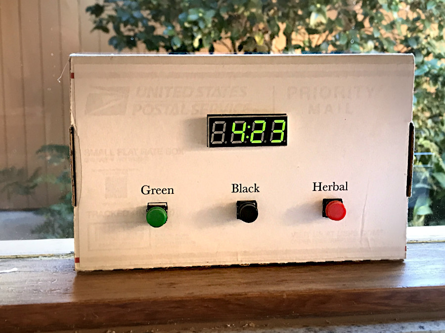
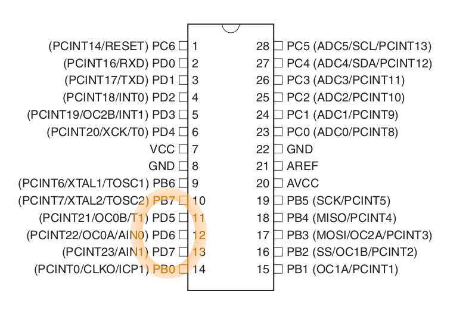
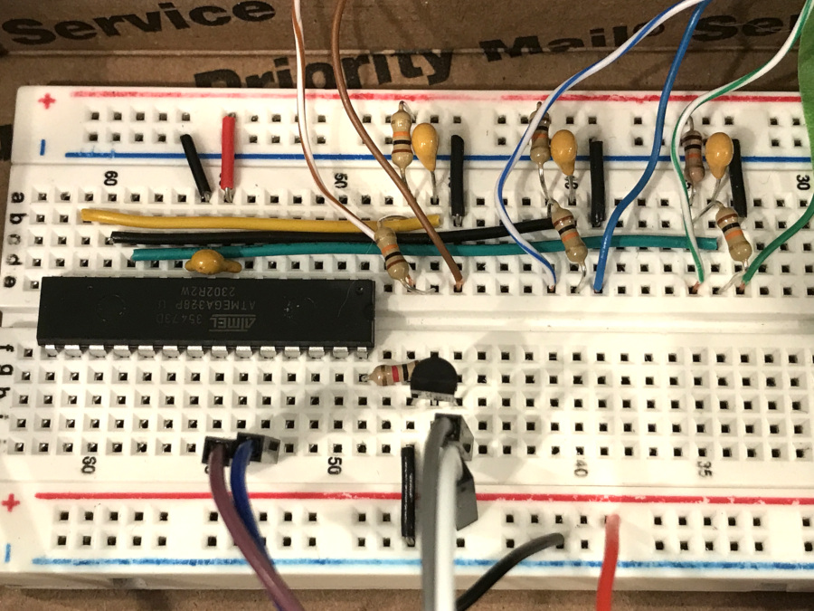
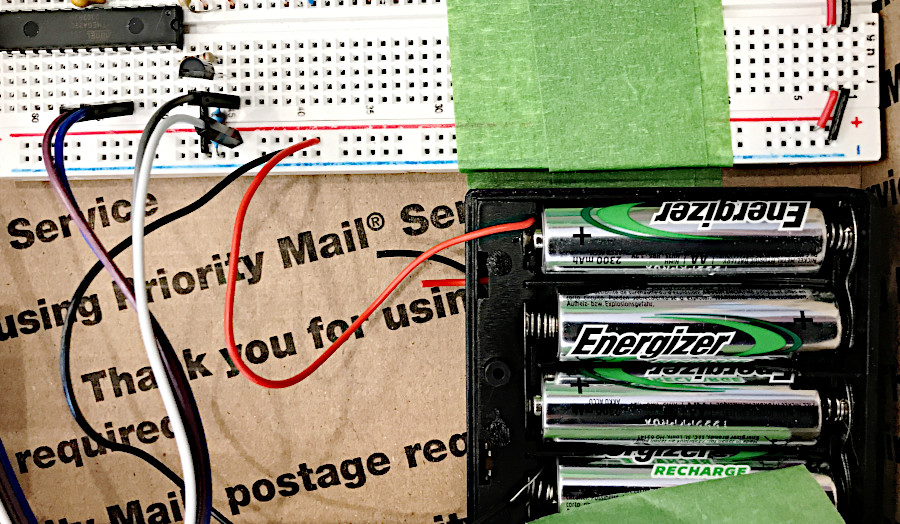
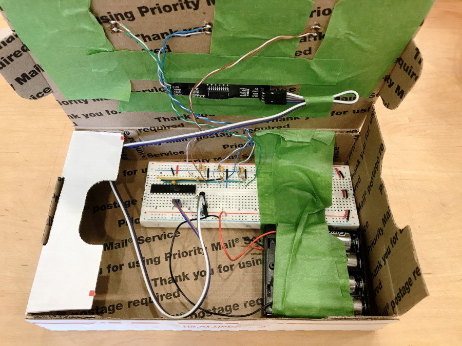

# Power-Down Sleep for a Year
Run an Arduino program for a full year on a single set of AA-size batteries.


This article describes a portable, battery-operated, tea-steeping timer that has been kept running continuously for a year. It was built using an ATmega328P controller like those found on Arduino Uno Rev 3 and previous boards. In this article we will often abbreviate the device name as simply: *328*.

## The Tea Timer
Figure 1 shows the device sitting on a kitchen windowsill. It happens to be awake in this photo. A TM1637 four-digit, 7-segment LED display module is presenting a countdown toward zero.

<br>
**Figure 1: A Battery-Operated Tea Timer** 

Three buttons beneath the display are labeled **Green**, **Black** and **Herbal**. We have three buttons because different preparations of tea need to steep for different lengths of time: green, 3 minutes; black, 5 minutes; and herbal, 7 minutes. Pressing a button selects a countdown corresponding to the color label.

The display goes dark when the device is asleep. Pressing one of the buttons wakes it up and starts the corresponding countdown automatically. When the countdown reaches zero, the device puts itself back to sleep.

During sleep, the current draw is a small fraction of one milliAmp. When active, it consumes about 25 mA, most of which is for the display. 

How can battery life be extended to last for weeks, or months, or even a full year? The answer is, by sleeping most of the time. 

The sections listed below describe techniques that were used to reduce power consumption. A link to references is also provided for readers seeking more detailed information. Readers may wish to open the example code in a separate window for convenient reference to line numbers mentioned in the text.

## Techniques

* [Separate the 328 from the Arduino](#separate-the-328).
* [Optionally, calibrate the internal oscillator of the 328 for high time accuracy without an external crystal](#calibrate-the-internal-oscillator).
* [Turn off all major components of the device that consume power](#turn-off-major-components).
* [Put the 328 into power-down sleep](#power-down-sleep).
* [Wake the device when a button is pressed down](#wake-up-from-sleep).
* [Choose an action based on which button was pressed](#service-the-interrupt).
* [Prepare the TM1637 display module](#prepare-the-tm1637-module).
* [Display a time countdown on a TM1637 module](#display-the-countdown).
* [Use Rechargeable NiMH Batteries](#use-nimh-rechargeable-batteries).
* [Learn more from the References](#references).

### Separate the 328
An Arduino development board includes a number of power-hungry components in addition to the ATmega328P microcontroller. There is a second controller just for interfacing between the 328's serial pins and a computer's USB port. Several linear voltage regulators and LEDs also draw current. 

The first big step toward minimal power is to use the 328 by itself. The chip can be gently pried off of an Arduino Uno. Or just buy a few. They are not expensive. Selected suppliers are listed in the References section at the end of this article.

Taking the 328 off the Arduino means using the chip's own pin-numbering scheme rather than the labels printed on the Uno board. Refer to the *28 SPDIP* figure on page 12 of the datasheet.

The second big step is to reduce the 328's CPU speed to 8 MHz from the 16 MHz pace in force on the Arduino development board. It cuts the power draw of the 328 in half. See Figure 31-333 on page 502 of the data sheet.

This change involves reprogramming the *low fuse byte* of the 328 to 0xE2. It is not difficult to do, using the *avrdude* utility that comes with the Arduino IDE. The procedure requires an ICSP programmer, which is easily prepared using the *Arduino as ISP* technique. Tutorials explaining all this can be found online. I might write one myself, some day. 

### Turn Off Major Components
The ATmega328P microcontroller combines many, different peripherals, which are just specialized circuits on its tiny sliver of silicon. Each circuit consumes power while performing one of the chip's powerful functions. Fortunately, each circuit can be turned off or on by the software running in the chip's CPU. This ability to turn off unused peripherals extends even to the CPU itself. 

A table might be the best way to list the different circuits and the way to turn each one off.

| Peripheral | How to Turn It Off |
| ---------- | ------------------ |
| ADC | First clear ADCSRA then PRR = 0xCF |
| TWI (I2C) | set PRR = 0xCF |
| SPI | set PRR = 0xCF |
| USART | set PRR = 0xCF |
| Timer 2 | set PRR = 0xCF |
| Timer 1 | set PRR = 0xCF |
| AC | set ACD bit in ACSR to logic 1 |
| WDT | run the \_\_WDT\_off() function |
| BOD | write the extended fuse byte to 0x07 |

#### Remarks on the table, above
* ADCSRA register - page 258 in the datasheet
* PRR register - page 54 in the datasheet
* ACSR register - page 244 in the datasheet
* WDT - the Watchdog Timer, pages 60-62 in the datasheet
* BOD - the Brown-Out Detector, pages 291 and 314 in the datasheet

Lines 112-120 in the example program turn off power to the peripherals that will not be used even when the 328 is awake. The \_\_WDT_off() function appears at lines 304 through 339. 

Note that Timer 0 remains enabled in the PRR because it will be used by the ```delay()``` function while the 328 is awake. Putting the 328 into power-down sleep turns off Timer 0 and the CPU, along with everything else.

Engineers would caution against turning off the Brown-Out Detector, which would continue running even during sleep modes. Its role is to protect the ATmega328 when the voltage falls too low. This project accepts the risk of brown-out as part of an experiment in reducing current consumption.   

[back to list of sections](#techniques)

### Calibrate the Internal Oscillator
This is an optional step. I include it here to illustrate an important capability of the ATmega328P. It features something it proudly calls a *Calibrated Internal RC Oscillator*, which provides the primary clock source when running the 328 without an external crystal. The datasheet has this to say about it:

<blockquote>
By default, the Internal RC Oscillator provides an approximate 8.0MHz clock. Though voltage and temperature dependent, this clock can be very accurately calibrated by the user. 
</blockquote>

The adjective, *approximate*, confesses a fairly wide degree of manufacturing variation in the oscillator's frequency. The datasheet tells us it will be within 10 percent of the nominal 8 MHz. In other words, expect to find it somewhere between 7.2 MHz and 8.8 MHz, perhaps, for any particular ATmega328P. 

However -- and this is important -- whatever the rate might be it will stay very consistent, holding voltage and temperature constant. Even better, user code can change the frequency by storing a value into the Oscillator Calibration register, named OSCCAL. See page 43 in the datasheet.

With the aid of an oscilloscope I discovered a value that would calibrate my particular 328 to run at 8 MHz almost perfectly. This value I stored into the non-volatile EEPROM memory of the device. Lines 138-143 in the example program retrieve this value and write it into OSCCAL. Result: my tea-timer ticks off the seconds like, well, clockwork.

[back to list of sections](#techniques)

### Power-Down Sleep
Just two lines of code, 189-190, put the 328 into its deepest,  most current-thrifty sleep mode.

Sleep modes are described on pages 48-50 in the datasheet. The Sleep Mode Control Register, SMCR, is detailed on page 53.

Notice that these lines occur in the ```loop()``` code block. Why there? 

The answer is because the device needs to be put back to sleep repeatedly, and the Arduino IDE uses the ```loop()``` for repetitive code. We will come back to this farther along in the article.

### Wake Up from Sleep
Only an external interrupt coming in through an I/O pin can wake up the 328 from power-down sleep when configured as this project does. Each of the buttons generates an interrupt. 

Now, this presents an interesting problem.

Arduino Uno programmers familiar with the ```attachInterrupt()``` command know that it supports only two I/O pins for use with external interrupts. However, we need three. 

The solution is to exploit a feature of the ATmega328P which the Arduino IDE ignores: pin-change interrupts. It turns out that any I/O pin on a 328 can trigger an interrupt. All we have to do is to tell the 328 which pins to use.

I/O pins on 8-bit AVR-family devices are organized into groups called PORTs. Lines 132-136 in the example configure pins 5, 6, an 7 of PORT D to trigger interrupts whenever the logical voltage level (that is, HIGH or LOW) changes on a pin.

Figure 2 displays the layout of pins on a bare 328 chip. An oval surrounds the three pins selected for interrupt purposes. Each of the pushbuttons will connect to one of these pins. 

<br>
**Figure 2: Showing PORT D pins 5, 6 and 7 on an ATmega328P**

The buttons are wired in such a way that pushing one down changes the logic level on its I/O pin to LOW from HIGH. Experiments persuaded me that this change needs to be very definite. For this reason, the buttons were *debounced* by means of a resistor-capacitor (RC) network. The technique is described in another repository of mine: [https://github.com/IowaDave/debounce\_for\_interrupts](https://github.com/IowaDave/debounce_for_interrupts). 

<br>
**Figure 3: ATmega328P with RC networks for three pushbuttons**

Figure 3 gives a close-up view of the circuit board in this project. The RC network and its connections run above the ATmega328P in this view. Thicker, solid-color wires connect to the three I/O pins on the 328. Pairs of thinner wires lead away from each network to its corresponding pushbutton.

As mentioned previously, pressing one of the buttons will signal an interrupt that wakes up the 328. Program execution resumes in the Pin Change Interrupt Service Routine (ISR), described in the next section. 

[back to list of sections](#techniques)

### Service the Interrupt
I mentioned previously that the I/O pins of an ATmega328P are organized into PORTs. A change in logic level on the PORT D pins will raise an interrupt named *PCINT2*. It does not matter which of the eight pins of PORT D changed; the signal will be the same. 

Therefore, the ISR has several tasks. Refer to lines 278-302 in the eample program.

The datasheet recommends always disabling sleep mode immediately upon entering the ISR. Line 281 takes care of it.

Next step is to inspect the logic levels of the three pins. A register in the 328 named PIND exposes the levels as bits 5, 6 and 7 of an 8-bit integer, corresponding to pin positions 5, 6 and 7 in the PORT D group. Line 286 reads the value and then shifts the bits down to positions 0, 1 and 2. Now the pins can be evaluated as a three-bit field ranging between 0b000 and 0b111.  

Lines 288-301 take an action if and only if the three bits exhibit certain patterns. For example, the value ```0b011``` indicates that PORT D pin 7 is grounded (logic level LOW because its button is pressed down) while pins 6 and 5 remain HIGH. The **Herbal** button connects to PORT D pin 7. Accordingly, the ISR starts the teaTime countdown value at 700, which will be interpreted elsewhere in the program to represent 7 minutes and 0 seconds.

Any value that does not match one of the ```case``` statements will result in no action. Why is that important? Because releasing a pushbutton will generate another interrupt when the associated pin changes back to logic level HIGH. In that case, however, the bit pattern (typically 0b111) would not match any of the ```case``` statements, causing it to be ignored.

Upon conclusion, the ISR exits and program execution resumes at the instruction *immediately following* the point where the device was put to sleep. That instruction is found on line 193. It turns on power to the TM1637 module. We might as well talk about that part next.

[back to list of sections](#techniques)

### Prepare the TM1637 Module
I postponed discussion of the TM1637 until now because the main topic for this article concerns the power-down sleep mode of an ATmega328P controller.

Arriving now at a code line that regulates power to the TM1637 may be the right moment to go back in time, to cover setting up the display module. This discussion will be necessarily brief.

For reasons that make sense to me, I prefer to write my own code for peripheral devices whenever my poor, dim brain can understand how the dear things work.  I believe I can learn more that way.

Yes, TM1637 libraries blanket the internet in all directions across Arduinoland. Some of them might even be useful. I  will not argue with any reader who chooses to use one of those libraries. In return, I ask readers to humor my preference and refrain from preaching at me about writing my own.

I do feel some shame that my TM1637 code is scattered amongst all the other code in the program. It really should be carved out into a separate file. My apologies.

Lines 64-104 declare a set of constants and function prototypes for the TM1637. You might notice that I use &ldquo;Arduino Language&rdquo; constants such as ```A0``` and ```A1``` to refer to certain pins of the 328. Comments on those lines identify where to find those pins on the bare device.
i

Lines 122-128 configure I/O pins on the 328 to connect with the TM1637. Note particularly that pin 28, identified here as ```A5```, will digitally control the gate of a MOSFET which, in turn, switches power to the TM1637 module on and off. The setup procedure begins with the display's power enabled.


My TM1637 function prototypes are fully defined in lines 199-276. Lines 145-152 call some of the functions to initialize the device.

Some of the TM1637 functions get called also in the ```loop()``` process, where they actually display the digits as the time counts down. The first time through, however, they will not be called because the ```teaTime``` variable does not yet contain a reportable value.

Just before putting the ATmega328P to sleep, lines 183-186 in the ```loop()``` process tell the logic board inside the TM1637 module to turn off its LEDs, then the MOSFET is told to switch off power to the module itself.

At this point, the system goes to sleep awaiting the next time someone presses one of the pushbuttons.

[back to list of sections](#techniques)

### Display the Countdown
OK, we have the TM1637 module set up and we have received an interrupt from one of the pushbuttons. The ISR has examined the buttons and assigned a value -- 300, 500 or 700 -- to a variable named ```teaTime```. How does that become a time display?

Begin with the variable's definition at line 108: ```volatile int16_t teaTime = -1```.

```int16_t``` declares it to be a signed, 16-bit integer.

```volatile``` is a *type qualifier* telling the compiler to make sure memory is always available for storing values into this variable. It is good practice to qualify a variable as volatile whenever it will receive a value inside an ISR.

Another good practice is to keep ISR code blocks very short. That is why the code for displaying the countdown is not included in the ISR even though the interrupt is what causes the display code to execute. Instead, the code appears inside a ```while (teaTime >= 0) {}``` control block at the beginning of the ```loop()``` process.

Here is what happens. The variable ```teaTime``` is defined initially to have the value &minus;1. At the top of the ```loop()``` process, the first time through lines 166-178, this value fails the test for being zero or greater. The display code inside the control block is not executed. The ```loop()``` proceeds to put the apparatus to sleep.

Then a pushbutton triggers an interrupt. The ISR assigns a positive number to ```teaTime``` when it recognizes a valid bit pattern. Code execution jumps to the bottom of the ```loop()``` where it turns on power to the TM1637.

What happens next? The ```loop()```... loops. It returns execution to the top of the process where the value of ```teaTime``` gets tested. Now it passes the test! The display code inside the control block will run. What does it do?

The value of ```teaTime``` is factored by powers of 10, storing a character into a buffer for each of the numbers of hundreds, tens and ones. TM1637 functions send the buffer to the display module.

```teaTime``` is decremented. The result is tested to make it time-like. For example 300 (representing 3:00) when decremented gives 299, which is converted to 259, reprsenting 2:59.

A ```delay(499)``` statement pauses for the remainder of 1 second. Why is the value 499? Because the Arduino ```delay()``` function expects the system clock to be running at 16 MHz, whereas ours is running at half that speed. We need wait only half as many *ticks* per second.

When the ```teaTime``` value reaches zero the display pauses a little longer. Can you see how it would be five seconds? And then, the ```teaTime``` value decrements further to &minus;1 and the ```while``` control block exits. 

There being nothing further to do about the recent press of the pushbutton, the ```loop()``` shuts down the TM1637 and puts the system back into power-down sleep.


[back to list of sections](#techniques)

### Use NiMH Rechargeable Batteries
The project uses a gang of four, rechargeable, nickle metal hydride (NiMH) batteries, AA-sized. Why did I choose these batteries?

<br>
**Figure 4: Showing the NiMH Rechargeable Batteries**

Firstly, their voltage characteristics are attractive. At full charge they assert a potential of 1.4 volts each. Four of them in series amount fo 5.6 volts, a level that my ATmega328P chip seems to tolerate very well. 

Secondly, the manufacturer of those pictured in Figure 4 rate them to have a 2300 mAH storage capacity. Somewhere I found data indicating that NiMH batteries can be depleted to 80 percent of capacity without harm. By that time their potential will have declined to 1 volt, which totals 4 volts in my configuration, still plenty for reliable operation.

I believe this voltage range of 4 to 5.6 using four NiMH batteries works better for an ATmega328P compared to the range of 4.5 and declining from a set of three alkaline batteries. Four alkalines would exceed 6 volts, too much oomph for a 328. 

With a running life of a year between recharges, I might never need to buy batteries for this team timer again in my life.

[back to list of sections](#techniques)

### Take a Last Look Inside
I built the tea timer into a used U.S. Priority Mail box that I found in the trash can at the Post Office. It was a little bit wrinkled so I printed a label to paste onto the front. It came out rather well, I think.

Anyway, before we close, Figure 5 gives you a last, long look inside this long-lived, battery-operated, portable appliance that has kept an Arduino program going for a full year. By the way, I measured the battery voltage eleven months after starting the program. It was still at 5 volts.

<br>
**Figure 5: The Inside Story!**


[back to list of sections](#techniques)


### References
My objective in writing has been to outline the project somewhat briefly. Each sectio identifies relevant line numbers from the example program provided in this repository. 

#### ATmega328P Datasheet
Some of the sections also refer to page numbers giving more detailed information in the official datasheet for the ATmega328P, specifically the &ldquo;Complete&rdquo; version named *ATmega48A/PA/88A/PA/168A/PA/328/P* dated in the year 2020 and having version number DS40002061B. 

At the time of writing in December, 2024 the datasheet was available on the manufacturer's web site at the following url: [https://ww1.microchip.com/downloads/aemDocuments/documents/MCU08/ProductDocuments/DataSheets/ATmega48A-PA-88A-PA-168A-PA-328-P-DS-DS40002061B.pdf](https://ww1.microchip.com/downloads/aemDocuments/documents/MCU08/ProductDocuments/DataSheets/ATmega48A-PA-88A-PA-168A-PA-328-P-DS-DS40002061B.pdf).

#### TM1637 Display Datasheet
The original datasheet is in Chinese. A translation into English could be accessed at the time of writing via the following URL:

[https://m5stack.oss-cn-shenzhen.aliyuncs.com/resource/docs/datasheet/unit/digi_clock/TM1637.pdf](https://m5stack.oss-cn-shenzhen.aliyuncs.com/resource/docs/datasheet/unit/digi_clock/TM1637.pdf)

Titan Microelectronics of Shenzen owns the copyright to the datasheet. In the spirit of fair use in an open-source framework, I have included a download of the document in this repository.


[back to list of sections](#techniques)


